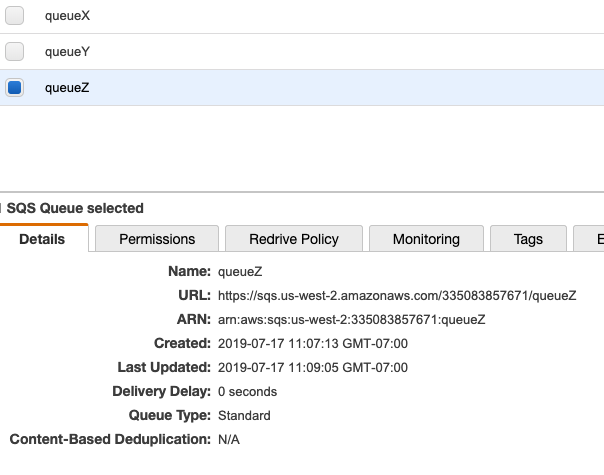
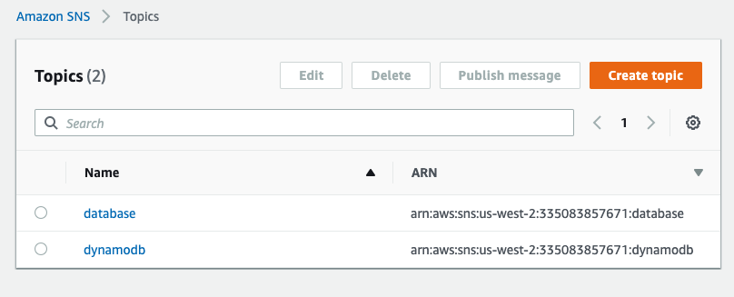
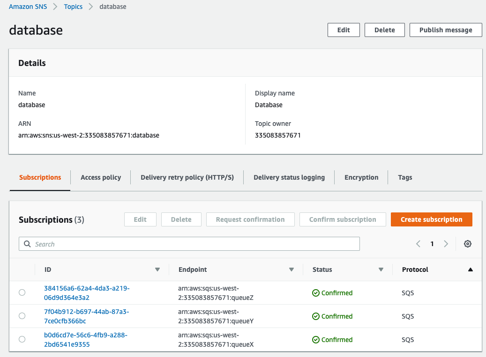

# Demo - Message Queues

Before you are able to run this demo you will need: 
- AWS free account 
- You must generate an AWS Access Key ID, and AWS Secret Access Key. These can all be done in the AWS Console where you signed up and logged in to https://aws.amazon.com 
- Install AWS CLI onto your laptop and make sure to add access key and secret access when prompted

## AWS SQS

## `sqs`

This demo contains 2 files, one for publishing, one for receiving messages from a queue.

* Ensure that your AWS credentials are installed on your machine and add if not
  * `aws configure`
* The demo and participation sections for lab require that you have your credentials
* To get setup, first, create an SQS queue in the AWS console
* Give it wide open permissions
  * Everyone (*)
  * Read, Send, Delete
  * just click the checkbox.
  
  

* In your terminal use `npm i` to install the dependencies
* Edit both of the files (`sqs-send.js`, `sqs-receive.js`)
  * Change the `arn` for the queue to point to the queue you created above
  * Change the messages if you desire 
 
 Once you're all setup, open up 2 terminal windows.
 
 1. Run `node sqs-receive.js`  This will "listen" for queued events
 1. Run `node sql-send.js`  This will send a new random event every .5 seconds
 1. Watch in amazement as your messages appear in the receiver window
 1. Now, we talk about scale ...
 1. Open a second terminal window and run `node sqs-receive` in that one
 1. You should see about 50% of the requests now going to each window.
 1. Imagine a world where you have 100,000,000 receivers (this is AWS scale)
 
 For the final part of the demo, invite the students to run the `sqs-receive.js` on their machines.  If they have credentials, this should work nicely, and you'll see the 'send' load now being distributed amongst all the class.  
 
 As they 'pop-in' and 'pop-out',  you can see the other machines bearing more/less of the overall messaging load. This is a good small-scale peek at how actual scale works.
 
 
## `sns`

This demo contains 4 files

* `pub.js` - Sends a message to the SNS system every .5 seconds
* `subX.js`, `subY.js`, `subZ.js` - These are copies of the receiver app from the first demo, but targeted at specific queues

To get this demo going
* Create 3 new Queues in SQS. 
  * For simplicity sake, name them *queueX*, *queueY*, *queueZ* 
  * Give them Read, Send, Delete permissions for everyone
  * Make note of their 'arn'
* Create a new SNS Queue
  * Add 3 Subscribers to it
  * Make them of type 'SQS', pointed the the associated arn
* Edit the `sub` files noted above
  * Point each of them at a different Queue
* Run each of them in a separate terminal window ...
  * `node subX.js`
  * `node subY.js`
  * `node subZjs`
* Run the publisher `node pub.js`
* Each of your running subscribers should be showing their own response to the same message, initiated by the SNS publisher
* Whew ...

